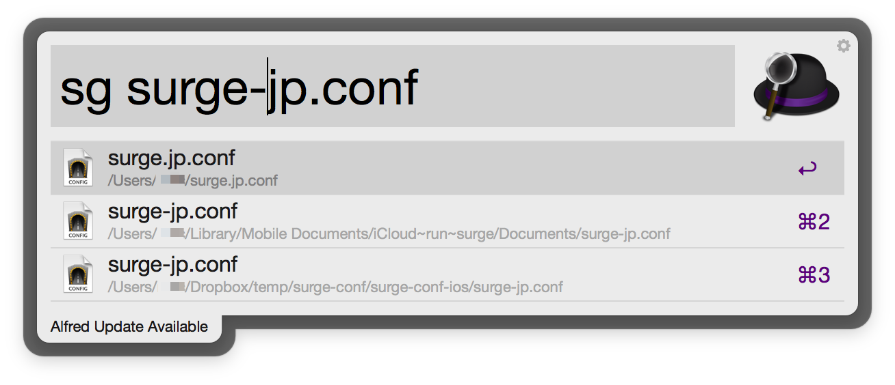

#Surge Conf Switcher —— 又一个 Alfred 插件

##功能
- 可以方便地切换不同的 Surge for Mac 配置文件
- 通过 `ln -s` 把已有的 `.conf` 文件符号链接到 `~/.surge.conf`，因此每次修改`.conf`文件后不再需要把它手动复制、重命名到`~/`
- 直接支持硬盘、DropBox、iCloud Drive里的 `.conf` 文件，同步无忧
- 切换后会自动重新加载配置文件(Surge版本至少为1.1.2)，不需要手动载入

##使用方法
1. 下载安装本workflow，需要 Alfred PowerPack
2. 输入 `sg 文件名`, alfred会执行文件搜索，选中你需要的`.conf`文件，回车即可。`.conf`的文件名最好不要以`.`开头，否则属于隐藏文件，很难被Alfred搜到
3. 本插件会自动建立符号链接、重新reload ~~关闭`Surge`、重新开启`Surge`~~

##进阶
- `sg`（即`Surge`缩写）这个触发关键字可以修改，请自行在Alfred里修改
- 文件较多时，可以自行修改workflow的`File Types` 和 `Search Scope`。请参考[Alfred官方帮助](https://www.alfredapp.com/help/workflows/inputs/file-filter/)
- 按住`cmd`再按回车，可以打开Finder，方便修改文件
- 推荐配合另一个Alfred插件[proxyswitcher](https://github.com/lululau/proxy-switcher-alfred-workflow)一起使用

##下载
[点击下载](https://github.com/goodbest/Alfred_SurgeConf_Switcher/raw/master/SurgeConf_Switcher.alfredworkflow)

#Credit
Made by goodbest